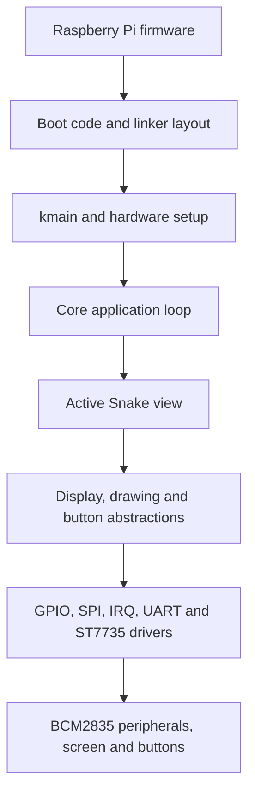

This repository contains a bare-metal Snake game built for the Raspberry Pi Zero W.

I created this project to understand what happens between powering on a board and running an application when there is no operating system, standard library or existing driver stack underneath it.

The game runs directly on the ARM1176JZF-S processor, renders to a 160 × 128 ST7735 screen over SPI and receives input from four GPIO buttons using hardware interrupts.

The main goal was not only to make Snake work. I also wanted to keep the project properly structured by separating the application, hardware abstractions, board configuration and low-level drivers.

### What bare metal means

A normal application runs on top of an operating system. The operating system initializes the processor, manages memory, handles interrupts and provides drivers for peripherals such as GPIO, SPI, timers and serial communication.

None of that is available here.

The Raspberry Pi firmware still performs the initial board boot and loads `kernel.img`, but once the ARM core starts executing the project, the program is responsible for everything else.

This includes setting up the stacks, clearing uninitialized memory, configuring the exception vectors, initializing the interrupt controller, programming the GPIO registers, communicating with the display and running the application loop.

The project is compiled as a freestanding program with:

```text
-ffreestanding
-nostdlib
-nostartfiles
```

There is no Linux kernel, process, terminal, filesystem or standard C runtime while the game is running.

### Hardware

The current implementation targets the following hardware:

| Component                | Purpose                                                            |
| ------------------------ | ------------------------------------------------------------------ |
| Raspberry Pi Zero W      | Runs the bare-metal kernel                                         |
| ST7735 160 × 128 display | Displays the menu and game                                         |
| Four push buttons        | Control the snake                                                  |
| MicroSD card             | Contains the Raspberry Pi firmware, configuration and kernel image |
| USB-to-UART adapter      | Optional serial debugging interface                                |

The display is configured for 16-bit RGB565 colours and communicates through SPI0.

### GPIO mapping

All pin assignments are centralized in `includes/system/mapping.h` and configured by `srcs/system/mapping.c`.

The numbers below are BCM GPIO numbers, not physical header pin numbers.

| Function             | BCM GPIO | Configuration        |
| -------------------- | -------: | -------------------- |
| SPI0 CE0             |        8 | Alternate function 0 |
| SPI0 MOSI            |       10 | Alternate function 0 |
| SPI0 SCLK            |       11 | Alternate function 0 |
| UART TX              |       14 | Alternate function 0 |
| UART RX              |       15 | Alternate function 0 |
| Display reset        |       22 | Output               |
| Left button          |       23 | Input with pull-up   |
| Up button            |       24 | Input with pull-up   |
| Right button         |       25 | Input with pull-up   |
| Down button          |       26 | Input with pull-up   |
| Display data/command |       27 | Output               |

The buttons use the internal pull-up resistors and falling-edge detection. Each button is therefore expected to pull its GPIO low when pressed.

The display power and ground connections depend on the exact ST7735 module and are not represented in software.

### From power-on to Snake

The complete execution path is:



Each layer only deals with the level directly below it. The Snake code does not write to SPI registers, and the SPI driver does not know anything about Snake.

### Boot process

The Raspberry Pi firmware reads `boot/config.txt` and loads `kernel.img` at address `0x8000`.

Execution begins at `_start` in `srcs/system/boot.s`.

| Step | Operation                                                   |
| ---: | ----------------------------------------------------------- |
|    1 | Disable IRQ and FIQ while the processor is being configured |
|    2 | Switch to IRQ mode and install the dedicated IRQ stack      |
|    3 | Switch to supervisor mode and install the main kernel stack |
|    4 | Clear the `.bss` section                                    |
|    5 | Call `kmain`                                                |
|    6 | Remain in an infinite loop if `kmain` ever returns          |

The linker script places the kernel at `0x8000` and defines the memory layout for `.text`, `.rodata`, `.data` and `.bss`.

It also reserves two separate stacks:

| Stack            |   Size | Purpose                                 |
| ---------------- | -----: | --------------------------------------- |
| Supervisor stack | 64 KiB | Normal kernel and application execution |
| IRQ stack        |  4 KiB | Hardware interrupt handling             |

Using a dedicated IRQ stack prevents interrupt handlers from sharing the same stack context as the normal application code.

### Kernel initialization

Once `kmain` starts, the hardware is initialized in a specific order.

First, the board mapping layer configures the GPIO functions used by UART, SPI, the display and the buttons.

UART is initialized next so that the remaining initialization steps can emit debug messages.

The interrupt subsystem then installs the exception vector table, resets the BCM2835 interrupt controller, registers the button handler and enables the GPIO interrupt line.

After that, the ST7735 driver and the generic display object are connected together. The display controller is reset, configured for 16-bit colours and prepared to receive framebuffer data.

Finally, the core application structure is created, Snake is registered as the current application and the main loop starts.

### Architecture

The architecture is divided into several distinct layers.

| Layer          | Responsibility                                                          |
| -------------- | ----------------------------------------------------------------------- |
| Application    | Contains the Snake state, rules and views                               |
| Core           | Selects the current application and executes its active view            |
| Abstractions   | Exposes generic display, drawing and button interfaces                  |
| System mapping | Describes how the application hardware is connected to the Raspberry Pi |
| Drivers        | Controls GPIO, SPI, UART, interrupts and the ST7735 controller          |
| Boot code      | Prepares the processor before entering C                                |
| Hardware       | BCM2835 peripherals, buttons and display                                |

This separation is the part I am most proud of in the project.

The application logic is not tied directly to the ST7735 controller or to BCM2835 registers. It works through interfaces that can be reused by another application or connected to another implementation.

### Application and view system

The core does not contain any Snake-specific logic.

An application provides its state and an array of views. Each view contains an `update` function and a `draw` function:

```c
typedef struct s_view
{
	void	(*draw)(void *app_data);
	void	(*update)(void *app_data);
}	t_view;
```

The application structure stores the state shared by its views:

```c
typedef struct s_app
{
	void	*app_data;
	t_view	*current_view;
	t_view	views[LEN_VIEW];
}	t_app;
```

The core only needs a pointer to the current application:

```c
typedef struct s_core
{
	t_display	*display;
	t_app		*current_app;
	uint32_t	dt;
	t_app		apps[LEN_APP];
}	t_core;
```

The main loop can therefore remain independent from every concrete application and screen:

```c
core.current_app->current_view->update(
	core.current_app->app_data
);

core.current_app->current_view->draw(
	core.current_app->app_data
);
```

Changing screen only requires changing `current_view`.

A new Snake screen can be added without modifying the central loop. The same core could also host another application by registering another `t_app` and selecting it through `current_app`.

### Snake views

Snake currently contains two views.

| View | Update responsibility                                          | Drawing responsibility          |
| ---- | -------------------------------------------------------------- | ------------------------------- |
| Menu | Wait for any directional button                                | Draw the menu background        |
| Game | Read input, move the snake, update fruit and detect collisions | Draw the board, snake and fruit |

The menu is intentionally minimal in the current version. Pressing any direction button switches the application to the game view.

When the snake collides with its own body, the game state is reset and the current view returns to the menu.

The view system keeps those transitions inside the Snake application instead of adding application-specific conditions to the kernel loop.

### Game state

The game uses a 12 × 12 logical grid.

Rendering coordinates are calculated from the actual display dimensions when Snake is initialized. The largest cell size that fits the grid is selected, then the board is centered on the display.

The gameplay state contains:

| State          | Purpose                                                   |
| -------------- | --------------------------------------------------------- |
| Snake body     | Stores the occupied grid positions                        |
| Head index     | Identifies the newest body segment                        |
| Length         | Controls how many body elements are active                |
| Next direction | Stores the direction requested by the player              |
| Last direction | Prevents an immediate 180-degree turn                     |
| Fruit          | Stores the position and active state of the current fruit |
| Alive state    | Represents whether the game is active                     |

### Circular snake body

The snake body is stored in a fixed-size circular buffer.

Instead of moving every body element each time the snake advances, the game increments the head index and writes the new position into the next buffer slot:

```c
game_state->head =
	(game_state->head + 1) % SNAKE_MAX_LEN;

game_state->body[game_state->head] = new_pos;
```

Older segments are accessed relative to the current head:

```c
(game_state->head - i + SNAKE_MAX_LEN)
	% SNAKE_MAX_LEN
```

This avoids copying the complete body during every movement update. Advancing the snake only requires writing its new head position.

The current body capacity is 40 segments.

### Movement and collisions

The snake begins in the center of the grid and initially moves to the right.

The direction buttons update `next_direction`, but the game compares the requested direction with `last_direction` before accepting it. This prevents the snake from immediately reversing into itself.

The board wraps around its edges. Leaving the left side enters from the right, leaving the top enters from the bottom and the same rule applies in the other directions.

The game therefore ends on self-collision, not on contact with a wall.

Only one fruit is active at a time. Its position is generated with the project’s small xorshift32 pseudorandom generator and rejected if the selected cell is already occupied by the snake.

Eating a fruit increases the body length and requests a new fruit position.

### Timing

The main loop targets 60 frames per second:

```c
#define TARGET_FPS 60u
#define FRAME_US (1000000u / TARGET_FPS)
```

At the beginning of each frame, the system timer is read and the elapsed time is stored in `core.dt`.

The active view is then updated and drawn. If the frame finishes early, the kernel waits for the remaining frame duration.

Snake movement is deliberately separated from rendering speed. The game accumulates `core.dt` and moves the snake approximately every 190 milliseconds:

```c
#define SNAKE_SPEED_US (0.19 * 1000000u)
```

This means the screen can be redrawn at 60 FPS without making the snake move once per rendered frame.

### Display abstraction

The application does not directly depend on the ST7735 driver.

A generic display object contains the screen dimensions, a framebuffer, an opaque driver pointer and a function table:

```c
typedef struct s_display
{
	uint16_t			width;
	uint16_t			height;
	uint16_t			x_offset;
	uint16_t			y_offset;
	void				*driver;
	const t_display_fn	*fn;
	uint16_t			*fb;
}	t_display;
```

The function table defines the operations expected from a display driver:

```c
typedef struct s_display_fn
{
	void	(*init)(t_display *display);
	void	(*reset)(t_display *display);
	void	(*set_window)(
		t_display *display,
		uint16_t x0,
		uint16_t y0,
		uint16_t x1,
		uint16_t y1
	);
	void	(*write_pixels)(
		t_display *display,
		const uint16_t *pixels,
		uint32_t count
	);
	void	(*write_color)(
		t_display *display,
		uint16_t color,
		uint32_t count
	);
}	t_display_fn;
```

The concrete ST7735 driver provides an implementation of this interface through `st7735_fn`.

Replacing the display controller would mainly require implementing another function table and connecting it to `t_display`. The Snake drawing code would not need to know which controller is behind the abstraction.

### Framebuffer and drawing

The display uses a full 160 × 128 RGB565 framebuffer.

Each pixel occupies two bytes, so the framebuffer requires 40,960 bytes. The caller provides this memory to the display abstraction; no dynamic allocation is used.

The generic drawing layer operates only on this framebuffer. It provides reusable primitives for pixels, lines, rectangles, squares, circles and screen clearing.

The Snake renderer uses these primitives to draw the board, body and fruit.

At the end of a frame, `display_flush_fb` selects the complete display window and sends the framebuffer through the active display driver.

The rendering path is therefore:

```text
Snake view
    → generic drawing functions
    → RGB565 framebuffer
    → generic display interface
    → ST7735 driver
    → SPI driver
    → display controller
```

### ST7735 driver

The ST7735 driver owns the controller-specific protocol.

It manages the display reset sequence, command and data modes, initialization commands, colour format, orientation, drawing window and pixel transfers.

The controller is configured with SPI mode 0, a clock divider of 64 and 16-bit RGB565 colours.

The driver uses GPIO for the reset and data/command signals, while bulk pixel data is transferred through SPI0.

No ST7735 command is exposed to the Snake application.

### Button interrupts

Buttons are handled through hardware interrupts instead of being continuously polled from the GPIO registers.

The complete input path is:

| Stage | Operation                                                                                                     |
| ----: | ------------------------------------------------------------------------------------------------------------- |
|     1 | A button pulls its GPIO input low                                                                             |
|     2 | The GPIO peripheral records a falling-edge event                                                              |
|     3 | GPIO Bank 0 raises an interrupt                                                                               |
|     4 | The ARM processor jumps to the IRQ vector                                                                     |
|     5 | Assembly saves the interrupted registers and calls the C dispatcher                                           |
|     6 | The dispatcher invokes `buttons_irq_handler`                                                                  |
|     7 | The handler clears the hardware event and sets a software flag                                                |
|     8 | The active view reads and clears the flag through `button_left`, `button_up`, `button_right` or `button_down` |

This keeps the low-level interrupt logic outside the application.

From the Snake view, a button behaves like a simple one-shot event. The application does not need to inspect pending interrupt registers or clear GPIO event bits.

### Interrupt architecture

The exception vector table contains handlers for reset, undefined instructions, supervisor calls, aborts, IRQ and FIQ.

Only the reset and IRQ paths are currently implemented. Other exceptions intentionally stop in place.

When an IRQ occurs, the assembly handler saves the volatile registers and link register on the dedicated IRQ stack before calling `handle_irq`.

The C interrupt driver reads the BCM2835 pending registers and dispatches the event through a table of registered handlers.

This makes the interrupt controller reusable. The button system is only one client registered on the GPIO Bank 0 interrupt line.

### UART debugging

UART0 is used as the project’s debug output.

Initialization progress, button presses, view changes and snake collisions are written to the serial connection.

The expected baud rate is 115200, with the UART clock initialized to 3 MHz through `boot/config.txt`.

UART is not required to play the game, but it is useful when debugging code that runs without a terminal or operating system.

### Driver layer

The drivers directly access memory-mapped BCM2835 registers.

| Driver   | Responsibility                                                       |
| -------- | -------------------------------------------------------------------- |
| `gpio`   | Pin functions, pull resistors, digital reads and writes, edge events |
| `spi`    | SPI0 configuration and byte transfers                                |
| `st7735` | Display-controller commands and RGB565 pixel transmission            |
| `irq`    | Exception vectors, interrupt controller and handler dispatch         |
| `uart`   | PL011 initialization, serial input and formatted debug output        |

The timer, random generator, mathematical helpers and small standard-library replacements are kept in the helper layer because they are reusable outside a particular application.

### System mapping layer

The mapping layer sits between the board wiring and the drivers.

The GPIO driver knows how to configure a pin, but it does not decide that GPIO 23 is the left button or that GPIO 27 controls the display’s data/command line.

Those decisions belong to `system/mapping`.

Centralizing the assignments makes the hardware setup easier to inspect and prevents pin numbers from being duplicated throughout the drivers and application.

### Memory management

The project does not use a heap or dynamic allocator.

The linker reserves the main and IRQ stacks, `.bss` is cleared manually during boot and the application state uses fixed-size structures.

The framebuffer is also allocated with a known size.

This keeps memory behaviour predictable, which is especially useful in a bare-metal environment where there is no operating system to manage virtual memory or detect invalid allocations.

### Project structure

| Path                       | Responsibility                                           |
| -------------------------- | -------------------------------------------------------- |
| `srcs/kmain.c`             | Initializes the hardware and runs the core loop          |
| `srcs/system/boot.s`       | Creates the stacks, clears `.bss` and enters C           |
| `srcs/system/interrupts.s` | Defines the exception vector table and IRQ entry         |
| `srcs/system/mapping.c`    | Configures the board-specific GPIO assignments           |
| `srcs/system/buttons.c`    | Converts GPIO interrupts into button events              |
| `srcs/app/snake/`          | Contains Snake initialization, state, views and gameplay |
| `srcs/display/`            | Provides the display abstraction and drawing primitives  |
| `srcs/drivers/`            | Implements the BCM2835 and ST7735 drivers                |
| `srcs/helpers/`            | Provides timing, random, math and standard helpers       |
| `includes/`                | Defines the public interfaces and shared structures      |
| `kernel.ld`                | Defines the kernel address, sections and stacks          |
| `makefile`                 | Cross-compiles and produces the bootable image           |
| `boot/config.txt`          | Tells the Raspberry Pi firmware how to load the kernel   |
| `boot/kernel.img`          | Raw image generated by the build                         |

### Building

The project must be cross-compiled because the development machine is expected to use another architecture.

The required commands must be available in `PATH`:

| Command                 | Purpose                                 |
| ----------------------- | --------------------------------------- |
| `arm-none-eabi-gcc`     | Compile and link ARM code               |
| `arm-none-eabi-objcopy` | Convert the ELF kernel into a raw image |
| `make`                  | Run the build rules                     |

Clone and build the project with:

```bash
git clone https://github.com/leonardecavele/rpi0w_bare_metal.git
cd rpi0w_bare_metal
make
```

`make` does not flash the SD card and does not start the game. It only builds the kernel.

The build produces three important files:

| File               | Description                                                 |
| ------------------ | ----------------------------------------------------------- |
| `build/kernel.elf` | Linked ELF file containing symbols and sections             |
| `kernel.map`       | Linker map useful for inspecting addresses and memory usage |
| `boot/kernel.img`  | Raw image loaded by the Raspberry Pi firmware               |

The final conversion is conceptually:

```text
C and assembly sources
    → object files
    → build/kernel.elf
    → boot/kernel.img
```

After `arm-none-eabi-objcopy` creates the raw binary, the Makefile pads `boot/kernel.img` to a multiple of 512 bytes.

The file that must be placed on the Raspberry Pi boot partition is:

```text
boot/kernel.img
```

### Makefile targets

| Command       | Result                                                |
| ------------- | ----------------------------------------------------- |
| `make`        | Build `boot/kernel.img`                               |
| `make clean`  | Remove object files and the `build` directory         |
| `make fclean` | Remove the build directory, kernel image and map file |
| `make re`     | Remove everything and rebuild from scratch            |

### Preparing the SD card

The SD card needs a FAT boot partition containing the Raspberry Pi firmware files required by the Pi Zero W.

The project’s `kernel.img` and `config.txt` must then be copied to that boot partition:

```bash
cp boot/kernel.img /path/to/boot-partition/kernel.img
cp boot/config.txt /path/to/boot-partition/config.txt
sync
```

`/path/to/boot-partition` is a placeholder for the mounted FAT boot partition of the SD card.

The supplied configuration contains:

```ini
kernel_address=0x8000
kernel=kernel.img
init_uart_clock=3000000
init_uart_baud=115200
uart_2ndstage=0
```

This tells the firmware to load `kernel.img` at address `0x8000`, which matches the address defined by `kernel.ld`.

After copying the files, unmount the SD card cleanly, insert it into the Raspberry Pi Zero W and power on the board.

There is no shell or command to execute on the Raspberry Pi. The game is the kernel and starts automatically.

### Controls

| Context | Button        | BCM GPIO | Action         |
| ------- | ------------- | -------: | -------------- |
| Menu    | Any direction |    23–26 | Start the game |
| Game    | Left          |       23 | Move left      |
| Game    | Up            |       24 | Move up        |
| Game    | Right         |       25 | Move right     |
| Game    | Down          |       26 | Move down      |

A direction opposite to the current movement is ignored to prevent the snake from reversing directly into its body.

### Current scope

The project currently focuses on the complete path from booting the ARM core to running an interactive graphical application.

It includes custom startup code, linker layout, exception vectors, interrupt dispatch, GPIO, SPI, UART, timing, an ST7735 driver, a framebuffer drawing layer, input abstractions and the Snake application.

It does not currently provide HDMI output, USB input, networking, a filesystem or multitasking.

Those limitations are intentional. The objective is to keep the system small enough to understand while still demonstrating a clean architecture across every layer, from the game rules down to the hardware registers.
